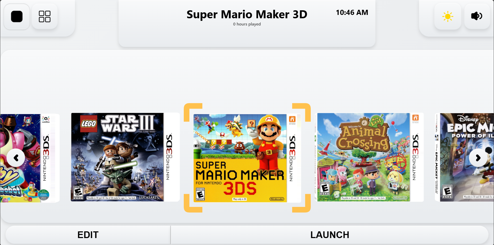
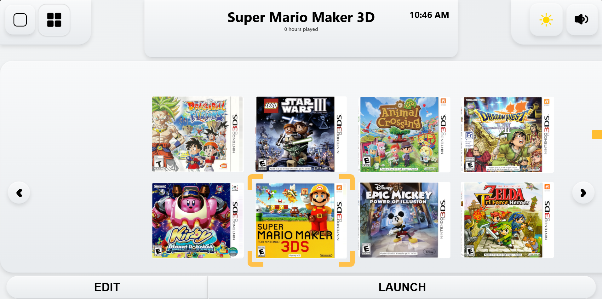
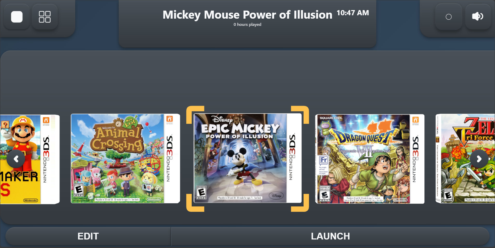
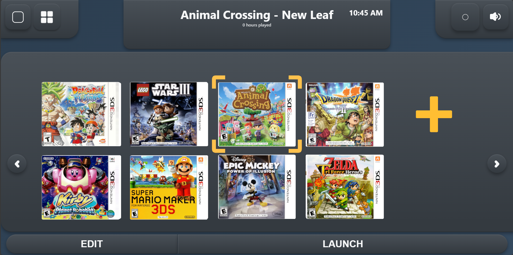

# Game Library

A desktop app for organizing and launching Nintendo 3DS games.  
Built with **React**, **Three.js**, and **Electron**, it features a 3D interactive shelf, auto-detection of ROMs and emulators, and integrated sound effects for a polished feel.


This project is licensed under the Creative Commons Attribution-NonCommercial-NoDerivatives 4.0 International License.  
You may share the work with attribution, but **modification or commercial use is not permitted**.

<div align="center">


*Clean, modern interface with single-row game display*

</div>

## 🎮 3D Game Cover Showcase

The app features fully 3D game covers that you can rotate and interact with. Each cover is rendered as a complete 3D mesh with proper depth and lighting.

<div align="center">


*Interactive 3D game covers with realistic rotation and depth*

</div>

## 📸 Theme Gallery

<div align="center">

| Light Theme | Dark Theme |
|-------------|------------|
|  |  |
| *Light theme with double-row layout* | *Dark theme with single-row layout* |
|  |  |
| *Light theme with single-row layout* | *Dark theme with double-row layout* |

</div>

>  Emulators and ROMs are not included. The app only supports local files.

---

##  Features

-  Interactive 3D shelf to display game covers
-  Hover & click selection with sound feedback
-  Auto-detects emulator and ROM paths
-  One-click "Launch" button using Electron IPC
-  Built-in UI sound effects for select, back, and rotation
-  Fully local — no tracking, no internet required

---

##  Tech Stack

- **Frontend:** React + TypeScript + Three.js  
- **Desktop Wrapper:** Electron (IPC, preload isolation)  
- **Audio:** Custom sound manager with multiple effect channels  
- **Database:** SQLite (Node server, via `server.js`)  

---

##  File Structure

```
frontend/       → React UI (3D shelf, overlays)
emulators/      → [IGNORED] Place your emulator executables here (e.g. Citra for 3DS)
roms/           → [IGNORED] Place your game ROMs here
src/assets/cover-art/  → Uploaded game cover images
```

> ** Folder Setup Required**  
> To ensure the app functions correctly, you must manually create the following directories:
>
> ```
> emulators/citra/      # Place your emulator executable here (e.g. citra-qt.exe)
> roms/3ds/             # Place your game ROMs here (e.g. GameTitle.3ds)
> ```
>
> **Expected Example Paths:**
>
> ```
> emulators/citra/citra-qt.exe
> roms/3ds/GameTitle.3ds
> ```

---

##  Getting Started
> ⚠️ This project is a personal launcher and does **not** include game files or emulators. You must supply your own.

###  Install dependencies

```
git clone https://github.com/tayyab3245/game-library.git
cd game-library/frontend
npm install
```
###  Start the frontend in dev mode

```
npm run electron-dev
```
###  (Optional) Build the frontend

```
npm run build
```
###  Start backend (for cover uploads & DB)
   
```
cd ../backend
npm install
npx nodemon server.js
```

### Customizing

- **Supported platforms:** Nintendo 3DS (`.3ds`, `.cia`)  
  Switch support is possible with appropriate emulator setup
- **Adding games:** Use the “Add New Game” button to upload a cover and set ROM/emulator paths
- **Audio files:** Located in `src/assets/audio`
- **Cover art:** Stored in `frontend/assets/cover-art`

### Demo Cover Art

This project includes a small set of 3DS game covers in `frontend/assets/cover-art/` for demonstration purposes only.  
These **are required** for the shelf to render properly. You can replace them with your own covers as needed.

Looking for more box art?  
You can find high-quality game covers here:  
>[The Cover Project – Nintendo 3DS (P)](https://www.thecoverproject.net/view.php?cat_id=54&view=p)


