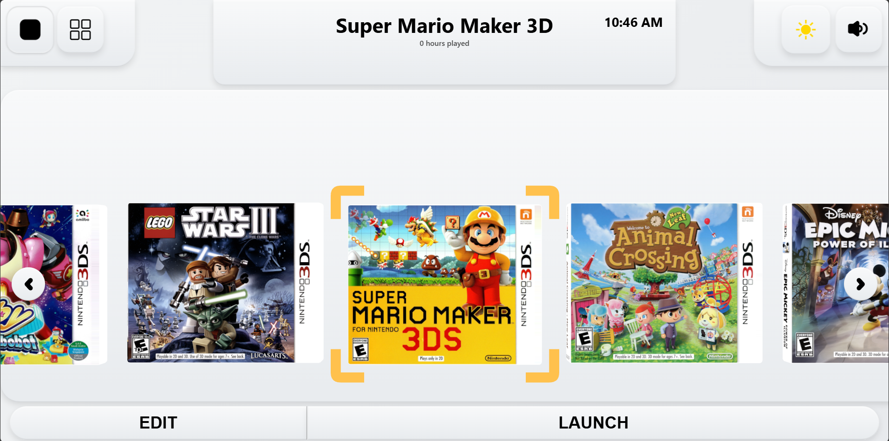
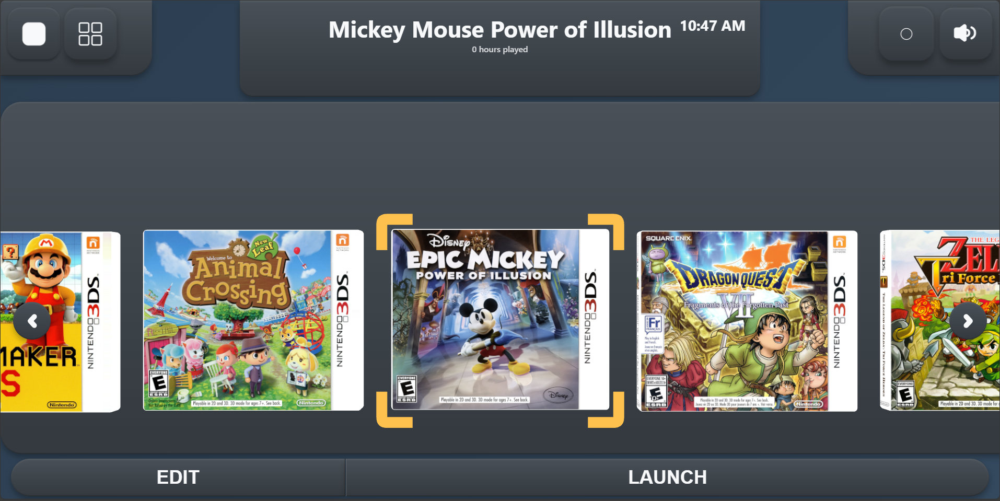
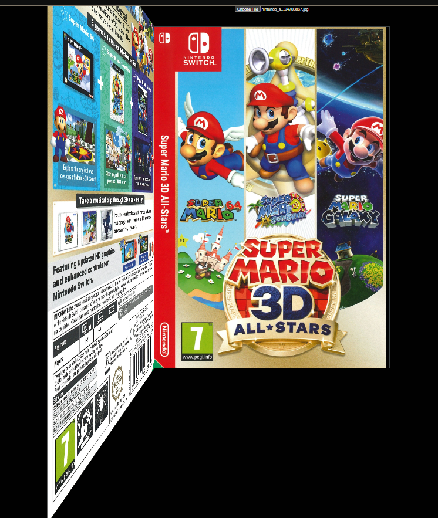
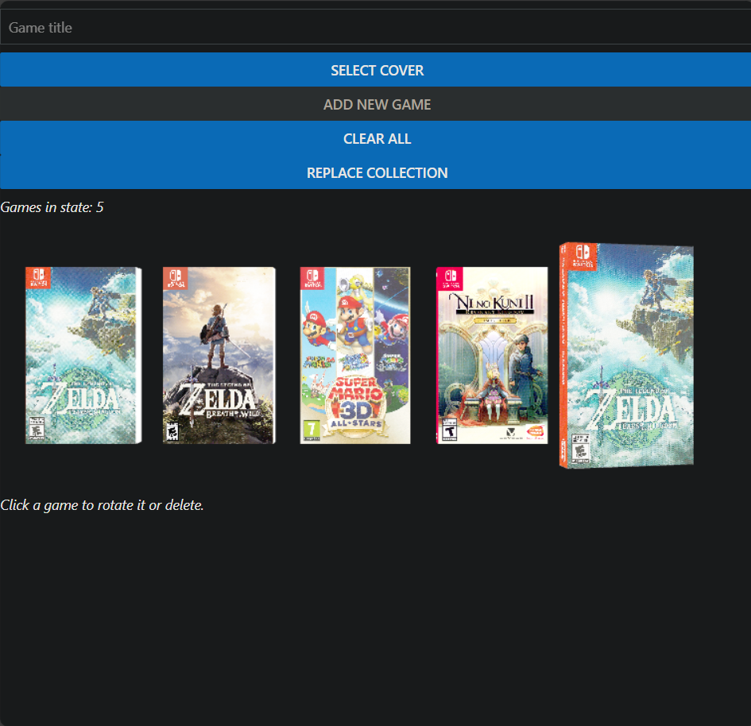
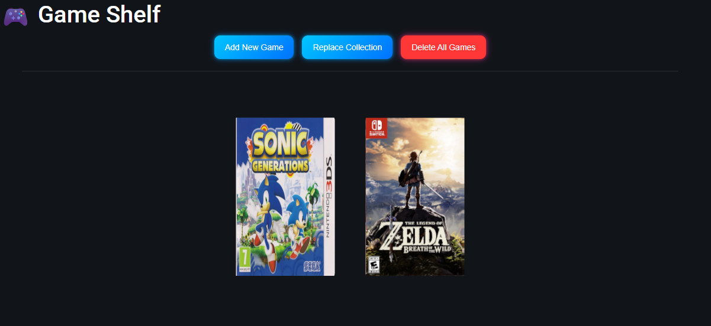
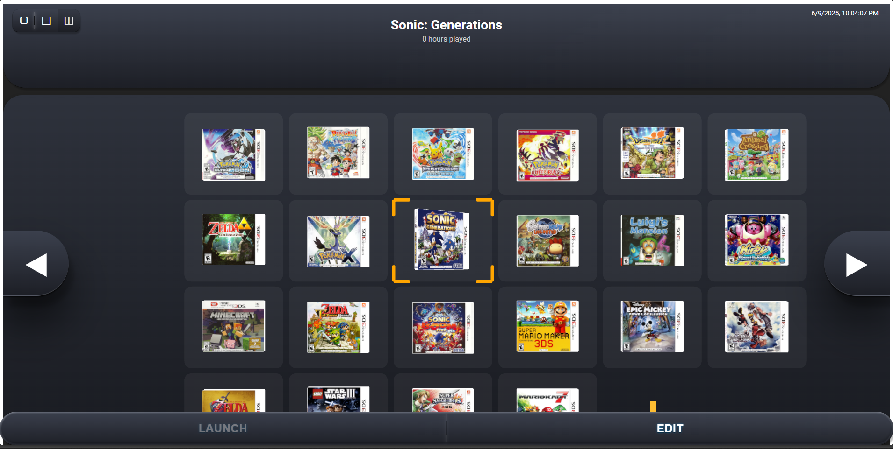
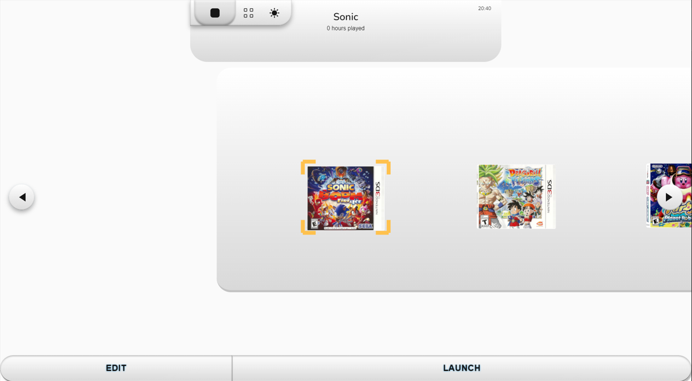
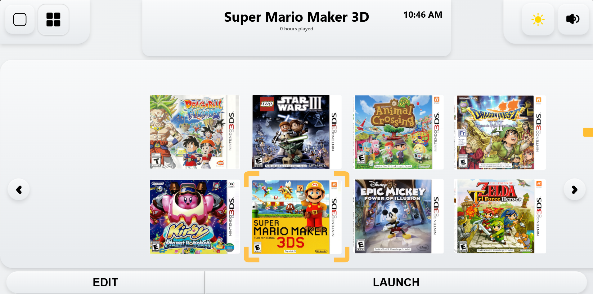

# Game Stash

A desktop application for organizing and launching your Nintendo 3DS game collection. Built with React, Three.js, and Electron.

## Download

[](https://github.com/tayyab3245/game-library/releases/latest)

**Installation Options:**
- **Portable Version** - `Game Stash 1.0.0.exe` (No installation required)
- **Full Installer** - `Game Stash Setup 1.0.0.exe` (Traditional installer)

**Requirements:** Windows 10/11


## Features

- Interactive 3D game library with Three.js rendering
- Automatic ROM and emulator detection
- Light and dark themes with single/double row layouts
- One-click game launching through Electron IPC
- Built-in sound effects and smooth animations
- Fully local - no internet connection required

## 3D Game Cover Showcase

The app features fully 3D game covers that you can rotate and interact with. Each cover is rendered as a complete 3D mesh with proper depth and lighting.

<div align="center">


---

*Interactive 3D game covers with realistic rotation and depth*

</div>

## Screenshots

| Light Theme | Dark Theme |
|-------------|------------|
|  |  |

> ⚠️ Emulators and ROMs are not included. The app only manages your existing local files.

## For Developers

```bash
# Clone the repository
git clone https://github.com/tayyab3245/game-library.git
cd game-library

# Install dependencies
npm install

# Start development mode
npm run dev
```

### Build Production Executable:
```bash
npx electron-builder build --win --publish=never
```

## Tech Stack

- **Frontend:** React + TypeScript + Three.js
- **Desktop:** Electron with IPC communication
- **Database:** SQLite for local game storage
- **Audio:** Custom sound manager with multiple channels

## License

This project is licensed under the Creative Commons Attribution-NonCommercial-NoDerivatives 4.0 International License. You may share the work with attribution, but modification or commercial use is not permitted.

---

## Development Journey

**See how this project evolved from concept to production**

<div align="center">

[](src/assets/screenshots/my-progress/progress-log.md)

### **1. 3D Breakthrough** → **2. Full-Stack Integration** → **3. Production Polish**

</div>

### **Milestone 1: Learning 3D Fundamentals**
*From flat textures to real 3D meshes*

<div align="center">

| Early 3D Experiments | First Real 3D Achievement |
|---------------------|---------------------------|
|  |  |
| *Learning Three.js fundamentals* | *First stable 5-game prototype* |

</div>

**Key Achievement:** Mastered Three.js camera systems, texture mapping, and scene graph hierarchy. Progressed from pseudo-3D effects to authentic 3D rendering with proper mesh geometry.

### **Milestone 2: Full-Stack Architecture**
*Building complete backend integration*

<div align="center">

| Nintendo 3DS Transformation | Advanced UI Systems |
|-------------------|-------------------|
|  |  |
| *Nintendo 3DS design pivot* | *Multi-configuration layouts* |

</div>

**Key Achievement:** Implemented Express.js server, SQLite database, and developed complex texture atlas segmentation for authentic 3DS game cases. Mastered UV coordinate calculations and professional-grade 3D asset pipeline.

### **Milestone 3: Production-Ready Polish**
*Complete modular system with professional architecture*

<div align="center">

| **Early Stable Version** | **Final Production** |
|-------------------------|----------------------------|
|  |  |
| *Early prototype with basic functionality* | *Final production-ready system* |

</div>

**Key Achievement:** Complete architectural refactoring with modular components, centralized theme management, and unified design tokens. Transformed from prototype to professional-grade, maintainable system.

---

<div align="center">

[](src/assets/screenshots/my-progress/progress-log.md)

</div>

*Want to see the full journey? The complete timeline contains 18 major development phases with detailed technical explanations, problem-solving approaches, and insights into building a complex 3D application.*
