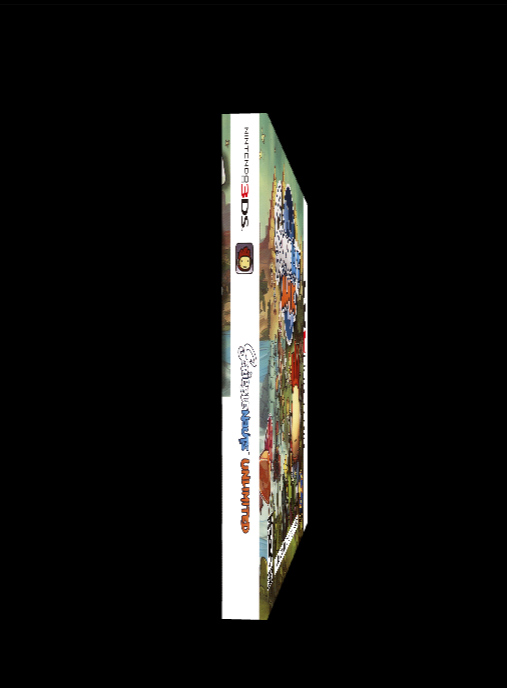
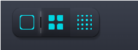
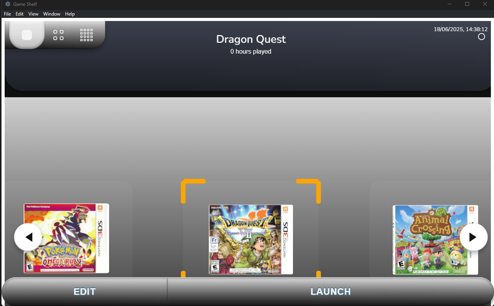
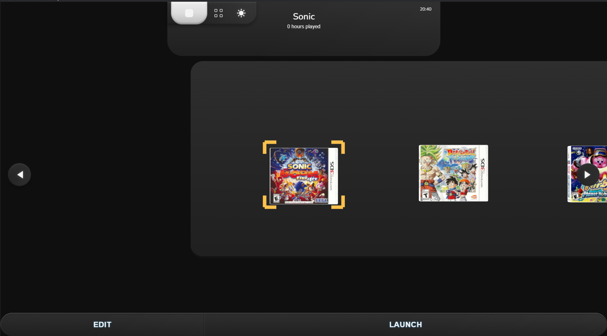

# Game Library

A desktop app for organizing and launching Nintendo 3DS games.  
Built with **React**, **Three.js**, and **Electron**, it features a 3D interactive shelf, auto-detection of ROMs and emulators, and integrated sound effects for a polished feel.


This project is licensed under the Creative Commons Attribution-NonCommercial-NoDerivatives 4.0 International License.
You may share the work with attribution, but **modification or commercial use is not permitted**.

## 🚀 Quick Start

```bash
# Install dependencies
npm install

# Start development mode (runs backend, frontend, and electron)
npm run dev

# Or run individual components:
npm run start:backend    # Start Express API server
npm run start:frontend   # Start React development server
npm run electron         # Start Electron app (after frontend is running)
```

<div align="center">


*Clean, modern interface with single-row game display*

</div>

## 🎮 3D Game Cover Showcase

The app features fully 3D game covers that you can rotate and interact with. Each cover is rendered as a complete 3D mesh with proper depth and lighting.

<div align="center">


---
*Interactive 3D game covers with realistic rotation and depth*

</div>

## 📸 Theme Gallery

<div align="center">

| Light Theme | Dark Theme |
|-------------|------------|
|  |  |
| *Light theme with double-row layout* | *Dark theme with single-row layout* |
|  |  |
| *Light theme with single-row layout* | *Dark theme with double-row layout* |

</div>

>  Emulators and ROMs are not included. The app only supports local files.

---

##  Features

-  Interactive 3D shelf to display game covers
-  Hover & click selection with sound feedback
-  Auto-detects emulator and ROM paths
-  One-click "Launch" button using Electron IPC
-  Built-in UI sound effects for select, back, and rotation
-  Fully local — no tracking, no internet required

---

##  Tech Stack

- **Frontend:** React + TypeScript + Three.js  
- **Desktop Wrapper:** Electron (IPC, preload isolation)  
- **Audio:** Custom sound manager with multiple effect channels  
- **Database:** SQLite (Node server, via `server.js`)  

---

##  Development Journey

*A quick overview of the major milestones that shaped this project*

<div align="center">

### **1. First 3D Breakthrough** → **2. Full-Stack Integration** → **3. Nintendo 3DS Vision** → **4. Advanced Polish** → **5. Production Ready**

</div>

---

###  **Milestone 1: Learning 3D Fundamentals**
*From flat textures to real 3D meshes*

<div align="center">

| Early 3D Experiments | First Real 3D Achievement |
|---------------------|---------------------------|
|  |  |
| *Learning Three.js fundamentals* | *First stable 5-game prototype* |

</div>

**Key Achievement:** Mastered Three.js camera systems, texture mapping, and scene graph hierarchy. Progressed from pseudo-3D effects to authentic 3D rendering with proper mesh geometry.

---

###  **Milestone 2: Full-Stack Architecture**
*Building complete backend integration*

<div align="center">

| Backend Development | Academic Submission |
|-------------------|-------------------|
|  |  |
| *First working backend with CRUD* | *Complete full-stack system for school* |

</div>

**Key Achievement:** Implemented Express.js server, SQLite database, RESTful APIs, and real-time UI updates. Achieved stable CRUD functionality with comprehensive error handling.

---

###  **Milestone 3: Nintendo 3DS Transformation**
*Authentic game case rendering with advanced texturing*

<div align="center">

| 3DS Inspiration | Complex UV Mapping | Perfect Result |
|----------------|-------------------|----------------|
|  |  |  |
| *Nintendo 3DS design pivot* | *Complex texture segmentation* | *Production-quality 3D assets* |

</div>

**Key Achievement:** Developed complex texture atlas segmentation for authentic 3DS game cases. Mastered UV coordinate calculations, texture bleeding prevention, and professional-grade 3D asset pipeline.

---

###  **Milestone 4: Advanced UI & Animation Systems**
*Nintendo-inspired design with sophisticated interactions*

<div align="center">

| Grid Layout Systems | Animated Components | Theme Architecture |
|-------------------|-------------------|-------------------|
|  |  |  |
| *Multi-configuration layouts* | *Physics-based animations* | *Dual-theme system* |

</div>

**Key Achievement:** Engineered sophisticated SVG animation systems replicating Nintendo's design patterns. Implemented physics-based bounce calculations, spring animations, and comprehensive theme architecture.

---

###  **Milestone 5: Production-Ready Architecture**
*Complete modular system with professional polish*

<div align="center">

| **Early Stable Themes** | **Final Production Themes** |
|-------------------------|----------------------------|
|  |  |
| *Early light theme with basic theming* | *Final light theme with unified design tokens* |
|  |  |
| *Early dark theme with component-level styling* | *Final dark theme with centralized management* |

</div>

**Key Achievement:** Complete architectural refactoring with modular components, centralized theme management, and unified design tokens. Transformed from component-level hardcoded styling to professional-grade visual consistency and maintainable, scalable code architecture.

---

##  Detailed Development Timeline

<details>
<summary><strong> Click to explore the complete development timeline</strong></summary>

> **Want to see how this project evolved from concept to production?**  
> This comprehensive timeline showcases every major milestone, technical challenge, and breakthrough moment in the development process.

###  **What You'll Discover:**
- **18 Major Development Phases** - From first 3D experiments to production-ready architecture
- **Technical Deep Dives** - Understanding Three.js, React, full-stack integration, and advanced graphics programming
- **Problem-Solving Journey** - Real challenges, setbacks, and breakthrough moments
- **Before & After Comparisons** - Visual progression showing each major improvement
- **Architecture Evolution** - How the codebase transformed from prototype to maintainable system

###  **Read the Full Journey:**
**[Complete Development Timeline →](frontend/src/assets/screenshots/my-progress/progress-log.md)**

*This document contains detailed technical explanations, screenshots from every development phase, and insights into the learning process behind building a complex 3D application.*

---

**Key Highlights from the Journey:**
-  **Learning 3D Graphics** - Mastering Three.js, WebGL, and advanced rendering techniques
-  **Full-Stack Architecture** - Building Express.js backend with SQLite and real-time updates  
-  **UI/UX Evolution** - Developing Nintendo-inspired design system with dual themes
-  **Performance Optimization** - Implementing object pooling, memory management, and GPU optimization
-  **Complex Problem Solving** - Tackling UV mapping, texture segmentation, and spatial algorithms

</details>

---

##  File Structure

```
frontend/       → React UI (3D shelf, overlays)
emulators/      → [IGNORED] Place your emulator executables here (e.g. Citra for 3DS)
roms/           → [IGNORED] Place your game ROMs here
src/assets/cover-art/  →  [IGNORED] Place your game cover images
```

> ** Folder Setup Required**  
> To ensure the app functions correctly, you must manually create the following directories:
>
> ```
> emulators/citra/      # Place your emulator executable here (e.g. citra-qt.exe)
> roms/3ds/             # Place your game ROMs here (e.g. GameTitle.3ds)
> ```
>
> **Expected Example Paths:**
>
> ```
> emulators/citra/citra-qt.exe
> roms/3ds/GameTitle.3ds
> ```

---

##  Getting Started
> ⚠️ This project is a personal launcher and does **not** include game files or emulators. You must supply your own.

###  Install dependencies

```
git clone https://github.com/tayyab3245/game-library.git
cd game-library/frontend
npm install
```
###  Start the frontend in dev mode

```
npm run electron-dev
```
###  (Optional) Build the frontend

```
npm run build
```
###  Start backend (for cover uploads & DB)
   
```
cd ../backend
npm install
npx nodemon server.js
```

### Customizing

- **Supported platforms:** Nintendo 3DS (`.3ds`, `.cia`)  
  Switch support is possible with appropriate emulator setup
- **Adding games:** Use the “Add New Game” button to upload a cover and set ROM/emulator paths
- **Audio files:** Located in `src/assets/audio`
- **Cover art:** Stored in `frontend/assets/cover-art`

### Demo Cover Art

Looking for more box art?  
You can find high-quality game covers here:  
>[The Cover Project – Nintendo 3DS (P)](https://www.thecoverproject.net/view.php?cat_id=54&view=p)

---

---
## ⚖️ License & Disclaimer


This project is licensed under the Creative Commons Attribution-NonCommercial-NoDerivatives 4.0 International License.
You may share the work with attribution, but **modification or commercial use is not permitted**.

**Please Note:** This software is provided for educational and archival purposes only. It does not include any copyrighted games, assets, or commercial emulators.
- Users are responsible for sourcing their own legally-owned game ROMs and associated assets.

