# Game Stash Development Journey
*A comprehensive timeline showcasing the evolution from concept to production*

---

##  Timeline Overview

> This document chronicles my complete development journey, from early 3D experiments to a production-ready game library with advanced features. Each milestone represents significant technical achievements and learning experiences.

---

##  **Phase 1: Foundation & Early Experiments**
*Learning 3D fundamentals and establishing core concepts*

### 🔬 **Milestone 1: First Steps Into 3D**
**Technologies:** Three.js, WebGL, Texture Mapping  
**Date:** Early Development Phase

| Before | After |
|--------|-------|
|  |  |

**🎯 Achievement:** Learning the Fundamentals

My journey began with learning how Three.js camera systems work and figuring out how to map flat textures onto 3D meshes. I was fascinated by the challenge of making 2D images feel three-dimensional. My first attempts were creative workarounds - smart tricks using geometric subdivision techniques to simulate 3D depth with planar surfaces rather than true volumetric meshes. It wasn't real 3D yet, but I was determined to understand texture coordinate mapping and camera perspective manipulation to achieve these pseudo-3D effects.

**🔧 Technical Highlights:**
- Three.js camera system integration
- Texture coordinate mapping fundamentals  
- Geometric subdivision techniques
- Camera perspective manipulation

---

###  **Milestone 2: Embracing True 3D Architecture**
**Technologies:** BoxGeometry, GPU Memory Management, Vertex Normals  
**Breakthrough:** Real 3D mesh systems

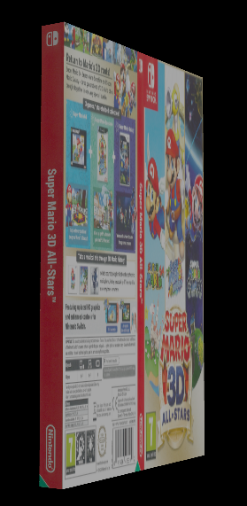

*First authentic 3D rendering attempt - raw geometry without lighting*

**🎯 Achievement:** The Big Switch

I made the leap to real 3D mesh systems using BoxGeometry with proper vertex normal calculations. I was worried about performance - would GPU memory allocation and draw calls slow everything down? This was my first real attempt at authentic 3D rendering, though it looked flat without proper material lighting models. No ambient occlusion, no directional lighting - just raw geometry. But it was progress.

**🔧 Technical Highlights:**
- BoxGeometry implementation
- Vertex normal calculations
- GPU memory optimization considerations
- Foundation for lighting system

---

###  **Milestone 3: Multi-Object Rendering Challenge**
**Technologies:** Object3D.clone(), Spatial Algorithms  
**Challenge:** Camera positioning and object arrangement

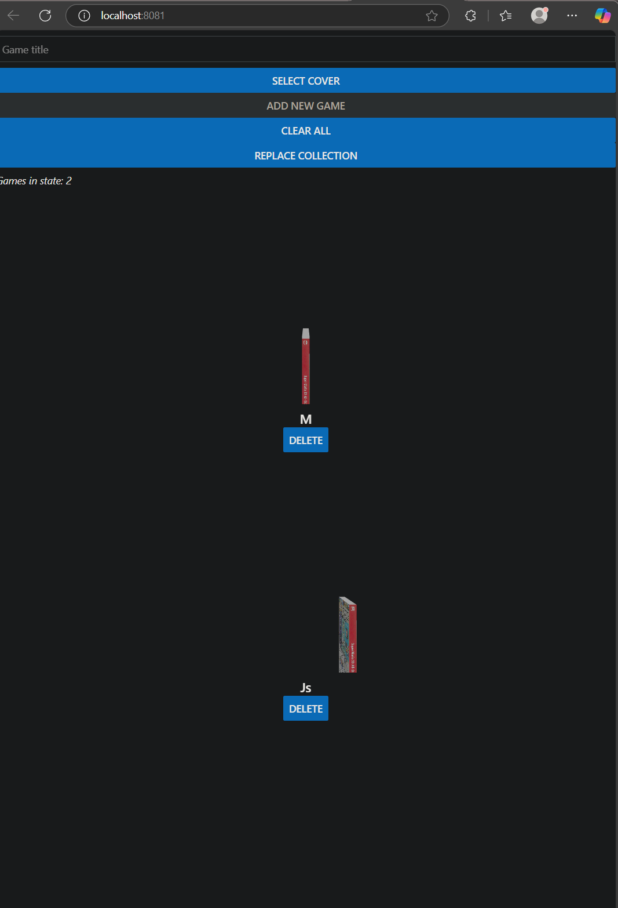

*Multiple game covers with spatial arrangement challenges*

**🎯 Achievement:** Multiple Objects, Multiple Problems

I successfully rendered more than one game cover instance using object3D.clone(), but I had no idea what I was doing with camera positioning. The games weren't arranged properly - no systematic positioning matrices, no proper orthographic projection setup. Objects were just floating randomly in 3D space. I needed to learn spatial arrangement algorithms, but I was excited to see multiple covers rendering at once.

**🔧 Technical Highlights:**
- Object3D.clone() implementation
- Multi-instance rendering
- Spatial arrangement algorithm needs identified
- Orthographic projection challenges

---

###  **Milestone 4: First Major Achievement**
**Technologies:** Scene Graph Hierarchy, Frustum Culling  
**Success:** Five-game prototype

*Five game covers with proper scene hierarchy - first real prototype*

**🎯 Achievement:** My First Real Achievement - Five Game Covers!

This was a huge milestone for me. I successfully rendered five separate game covers with proper scene graph hierarchy and camera positioning. I had figured out basic frustum culling and consistent mesh scaling factors. The texture loading pipeline finally worked with Three.js materials. This felt like my first real prototype - something I could actually show off.

**🔧 Technical Highlights:**
- Scene graph hierarchy implementation
- Frustum culling optimization
- Consistent mesh scaling
- Functional texture loading pipeline

---

##  **Phase 2: Interactivity & UI Development**
*Building user interface and interactive systems*

###  **Milestone 5: DOM Integration Challenge**
**Technologies:** CSS Positioning, DOM Overlays, Viewport Transformations  
**Focus:** UI overlay development

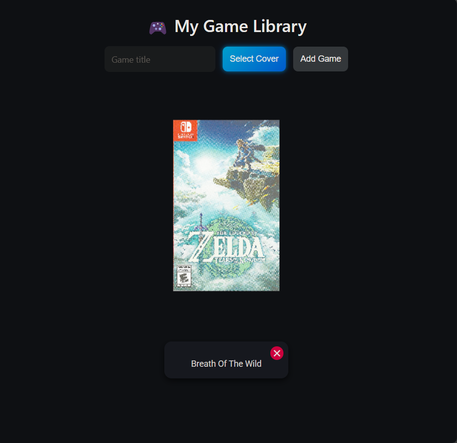

*First attempt at integrating DOM elements with 3D scene*

**🎯 Achievement:** Adding Interactivity - The UI Challenge Begins

I wanted titles for each game and a delete button, so I dove into integrating DOM overlays with CSS positioning calculations relative to 3D object screen projections. Getting long-press event detection working with setTimeout patterns was tricky. The real challenge was coordinating 3D scene interactions with 2D DOM elements - viewport transformation matrices became my new obsession.

**🔧 Technical Highlights:**
- DOM overlay integration
- CSS positioning calculations
- Long-press event detection
- Viewport transformation matrices

---

###  **Milestone 6: Advanced Selection System**
**Technologies:** Three.js Raycaster, WebGL Coordinates, Matrix Transformations  
**Complexity:** Mouse-to-3D intersection detection

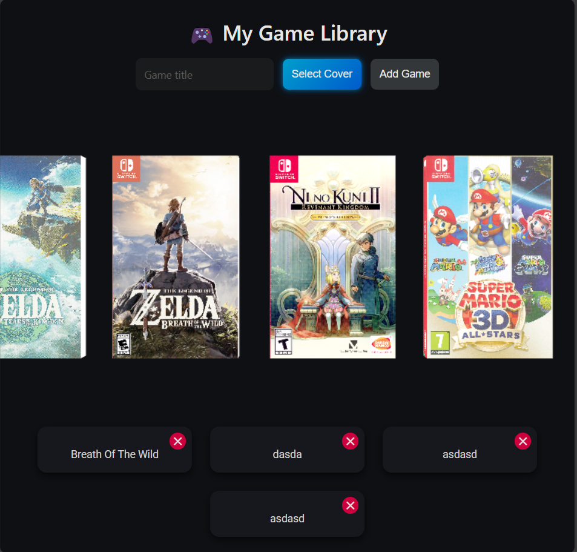

*Working selection system with individual game titles*

**🎯 Achievement:** The Selection System - A Serious Technical Challenge

I had working titles per game, but I wanted a single bubble showing which game was selected. This was where things got really complicated. I needed to understand Three.js Raycaster for mouse-to-3D object intersection detection and completely refactor my event handling architecture. The challenge of bridging WebGL coordinate systems with DOM events required extensive matrix transformation calculations. Plus, I was building the server-side REST API integration at the same time - it was overwhelming but exciting.

**🔧 Technical Highlights:**
- Three.js Raycaster implementation
- Mouse-to-3D intersection detection
- Event handling architecture refactor
- WebGL/DOM coordinate bridging

---

##  **Phase 3: Full-Stack Integration**
*Backend development and complete system architecture*

###  **Milestone 7: Backend Architecture Success**
**Technologies:** Express.js, SQLite, RESTful APIs, Real-time Updates  
**Achievement:** Complete full-stack integration

| Before Backend | With Working Backend |
|---------------|---------------------|
| 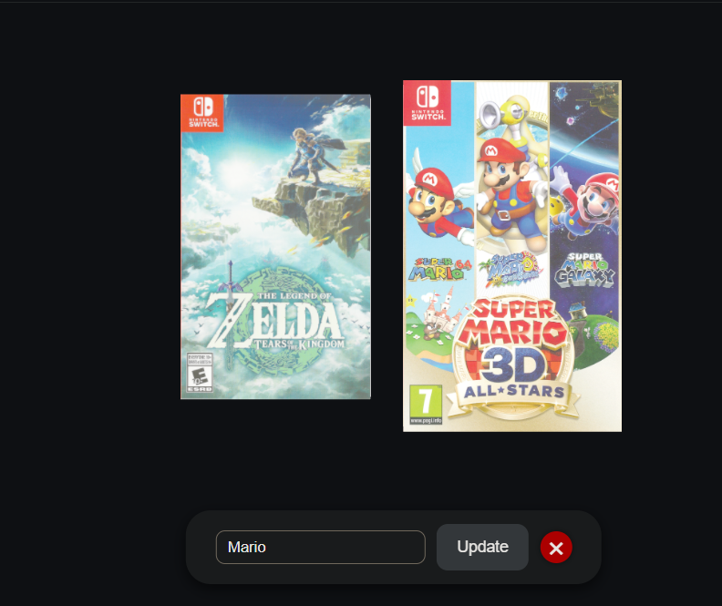 | *Full-stack functionality achieved* |

**🎯 Achievement:** Backend Finally Working - Full-Stack Achievement

I was so proud when I got all my games displaying with a working backend! Complete client-server architecture with Express.js, SQLite database, and RESTful API endpoints. I could finally update names and delete games from the server. The technical implementation of real-time UI updates following database mutations was challenging, but seeing it all work together was incredibly satisfying.

**🔧 Technical Highlights:**
- Express.js server architecture
- SQLite database integration
- RESTful API endpoints
- Real-time UI updates
- Database mutation handling

---

###  **Milestone 8: Academic Milestone**
**Technologies:** CRUD Operations, Error Handling, Data Validation  
**Significance:** School project submission

*Second stable iteration - submitted to professor*

**🎯 Achievement:** Second Working Version - Academic Milestone

This was my second stable iteration and I was incredibly proud of it - this is what I submitted to my professor for school! I had achieved stable CRUD functionality with comprehensive database schema design and proper API endpoint architecture. At this stage, I was still working with Nintendo Switch titles, but the full-stack integration was solid. The system included proper error handling, data validation, and responsive UI feedback mechanisms. It felt amazing to have a working application that could manage games end-to-end.

**🔧 Technical Highlights:**
- Stable CRUD functionality
- Comprehensive database schema
- Proper error handling
- Data validation systems
- Responsive UI feedback

---

##  **Phase 4: Advanced Features & Polish**
*Implementing sophisticated interactions and visual enhancements*

###  **Milestone 9: Dynamic Rotation System**
**Technologies:** Quaternions, SLERP Interpolation, RequestAnimationFrame  
**Enhancement:** Smooth rotation mechanics

*Games with smooth rotation capabilities*

**🎯 Achievement:** Adding Rotation - Bringing Games to Life

I came back to the project after some time and decided to add full rotation to the game covers. Implementing quaternion-based rotation controls with smooth interpolation algorithms was a technical challenge, but seeing the games rotate smoothly was so satisfying. I used requestAnimationFrame optimization and had to understand Euler angles and gimbal lock prevention to get natural rotation behavior with SLERP interpolation.

**🔧 Technical Highlights:**
- Quaternion-based rotation controls
- SLERP interpolation algorithms
- RequestAnimationFrame optimization
- Euler angles and gimbal lock prevention

---

###  **Milestone 10: Emulator Integration**
**Technologies:** Filesystem APIs, Binary Status Indication, Real-time Monitoring  
**Innovation:** Play button with status lights

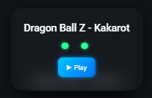

*Play button with LED status indicators for ROM/emulator availability*

**🎯 Achievement:** Making It More Than a Display - Play Button with Status Lights

I wanted my project to be more than just a cover display, so I added a play button with emulator and ROM support. The two green LED indicators showed the status of whether files were available - it was like a traffic light system! I developed binary status indication through filesystem API integration with real-time monitoring. I later simplified this approach, but seeing those status lights work was exciting.

**🔧 Technical Highlights:**
- Filesystem API integration
- Binary status indication system
- Real-time file monitoring
- LED-style visual feedback

---

##  **Phase 5: Design Evolution & Nintendo Inspiration**
*Transitioning to Nintendo 3DS aesthetic and advanced UI patterns*

###  **Milestone 11: Nintendo 3DS Transformation**
**Technologies:** UV Mapping Recalculation, Mesh Proportions, Texture Scaling  
**Inspiration:** Nintendo 3DS game case design

| Switch Era | 3DS Transition | Properly Scaled |
|-----------|---------------|-----------------|
| 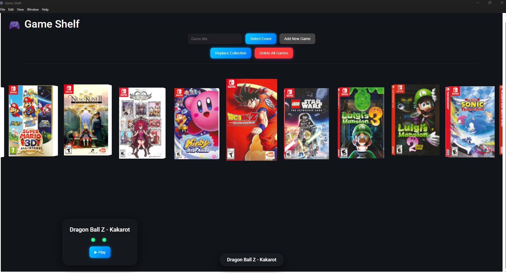 |  | 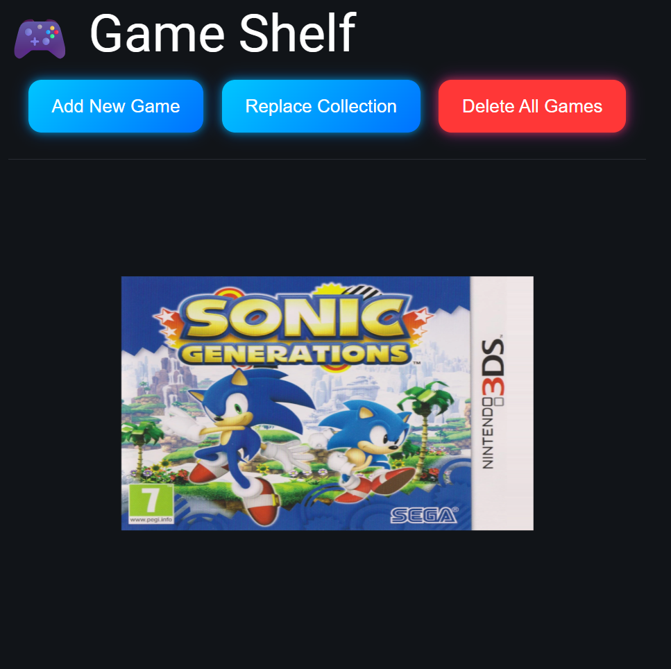 |

**🎯 Achievement:** The Nintendo 3DS Pivot - Following My Inspiration

I realized I wanted to design a Nintendo 3DS-inspired UI. I've always been inspired by Nintendo's design, and after playing my 3DS recently, I added my first 3DS title - Sonic Generations. The mesh dimensions were completely wrong though (still tuned for Switch cartridges). This transition required completely recalculating UV mapping coordinates, texture scaling factors, and mesh proportions to match physical 3DS game case specifications.

**🔧 Technical Highlights:**
- UV mapping coordinate recalculation
- Texture scaling factor adjustment
- Mesh proportion optimization
- Physical case specification matching

---

###  **Milestone 12: Complex Texture Segmentation**
**Technologies:** Texture Atlas Segmentation, Custom UV Coordinates, Bleeding Prevention  
**Complexity:** Three-part texture mapping (front, back, spine)

| Debug Phase 1 | Debug Phase 2 | Final Result |
|--------------|---------------|--------------|
|  | 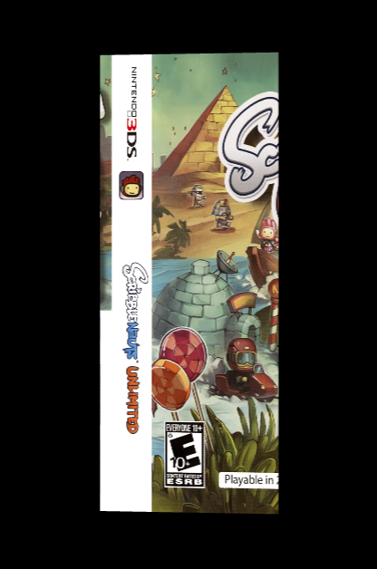 | 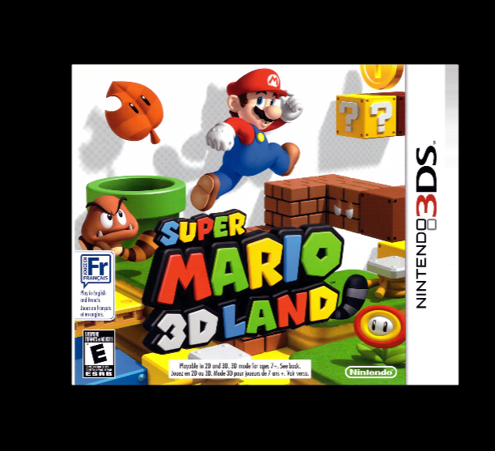 |

**🎯 Achievement:** The Complex Challenge of Real 3DS Covers

This was one of the most technically challenging parts of my journey. I wanted my covers to look exactly like real Nintendo 3DS game cases, which meant dividing each cover image into three parts: front, back, and spine. I had to develop a complex texture atlas segmentation algorithm with custom UV coordinate calculations. Getting the texture sampling right to prevent bleeding between regions while maintaining seamless transitions was incredibly difficult, but I was determined to make it perfect.

**🔧 Technical Highlights:**
- Texture atlas segmentation algorithm
- Custom UV coordinate calculations
- Texture bleeding prevention
- Seamless region transitions
- Production-quality asset pipeline

---

## 🏗️ **Phase 6: System Architecture & Optimization**
*Scaling to multiple games and advanced rendering techniques*

### 📈 **Milestone 13: Multi-Game Performance Optimization**
**Technologies:** Object Pooling, Memory Management, Batch Rendering  
**Scale:** Growing game collection

| Multi-Game Rendering | Camera Optimization | Selection Framework |
|---------------------|-------------------|-------------------|
|  | 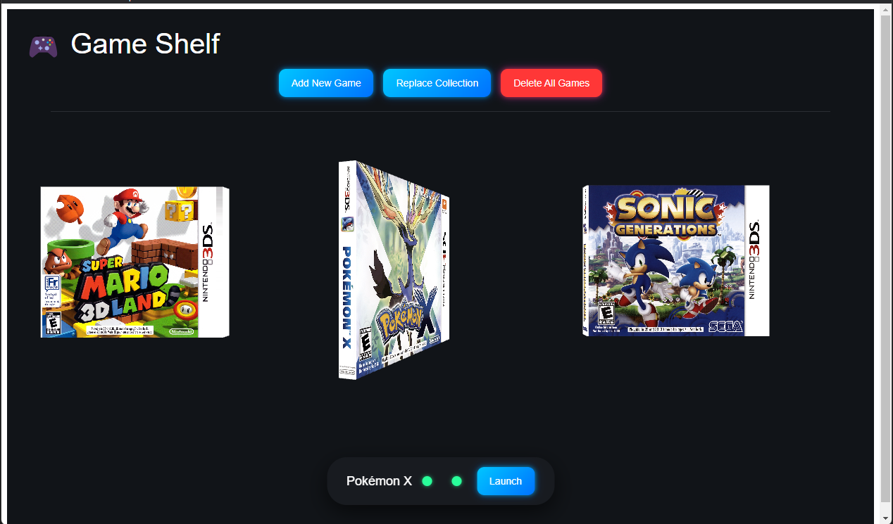 | 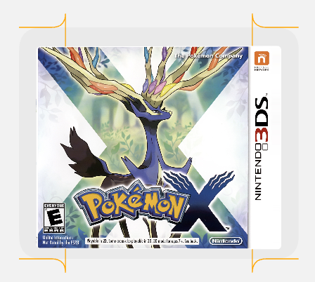 |

**🎯 Achievement:** Growing My Collection - Technical Scaling Challenges

As I added more games, I faced new technical challenges with memory management and GPU optimization. I was excited to see multiple games displayed together, but I had to implement object pooling patterns to reduce performance issues and optimize rendering through batch techniques. Watching my collection grow while maintaining smooth performance felt like a real achievement.

**🔧 Technical Highlights:**
- Object pooling patterns
- GPU memory optimization
- Batch rendering techniques
- Performance scaling solutions

---

###  **Milestone 14: Advanced Geometry & Visual Polish**
**Technologies:** Subdivision Surfaces, Bézier Curves, Phong Shading  
**Focus:** Organic shapes and lighting enhancement

| Geometric Evolution | Before Lighting | After Enhancement |
|-------------------|-----------------|-------------------|
| 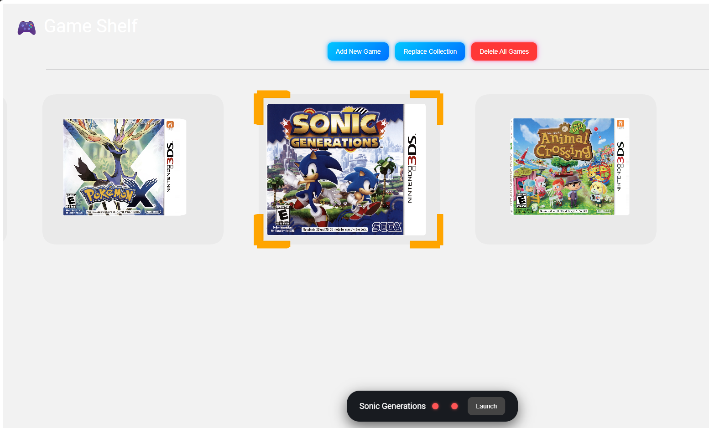 | 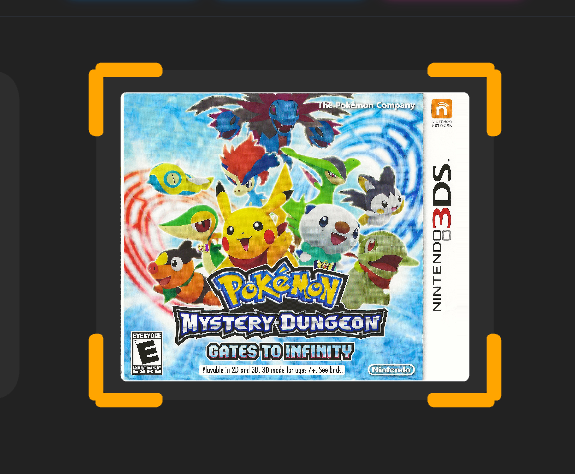 | 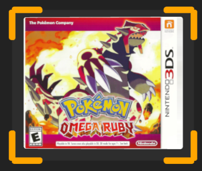 |
|  | | |

**🎯 Achievement:** Making Everything Smooth and Organic

I wanted my game covers to have that smooth, rounded look that felt more organic and pleasant. Implementing sophisticated edge rounding algorithms using subdivision surface techniques and Bézier curves was incredibly complex, but the results were so worth it. Understanding geometric continuity and vertex normal smoothing while maintaining proper UV mapping across modified geometry was challenging, but seeing those soft, rounded corners made the whole collection look so much more polished.

**🔧 Technical Highlights:**
- Subdivision surface techniques
- Bézier curve calculations
- Geometric continuity principles
- Vertex normal smoothing
- Advanced lighting models (Phong shading)
- Texture filtering optimization

---

##  **Phase 7: Interface Maturation & Control Systems**
*Developing sophisticated UI components and navigation systems*

###  **Milestone 15: Navigation & Control Evolution**
**Technologies:** Event Handling, State Synchronization, CSS Flexbox  
**Focus:** Intuitive user interface development

| Navigation Addition | Command Bar Struggles | Design Success |
|--------------------|---------------------|----------------|
| 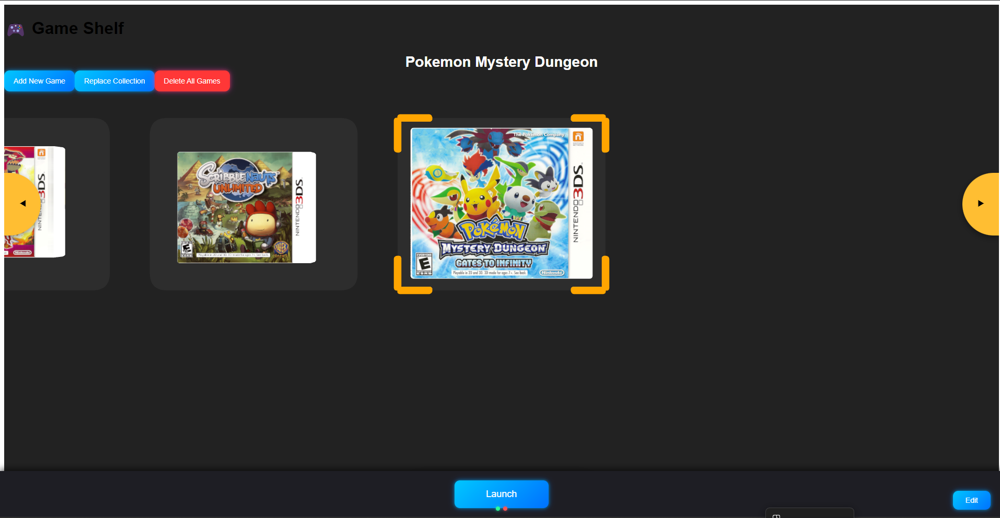 | 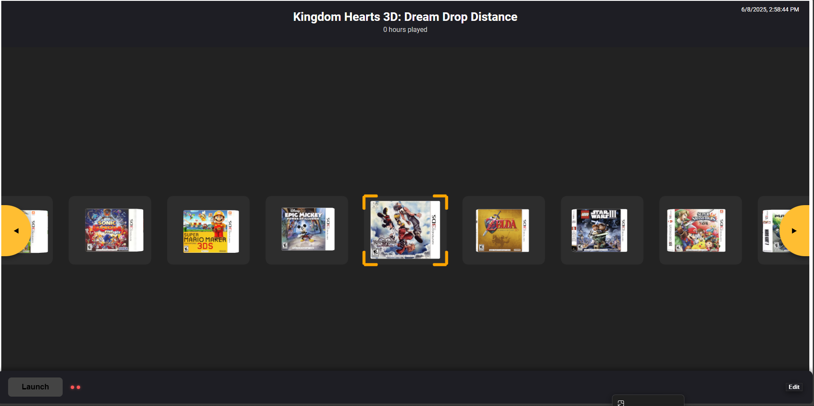 | 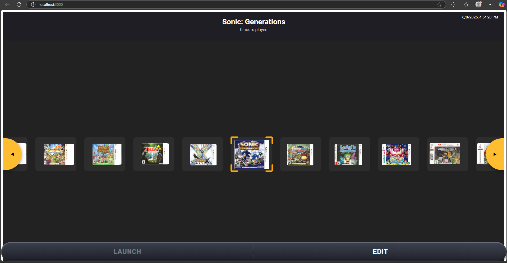 |

**🎯 Achievement:** Building Intuitive Navigation Systems

I added side navigation controls to make browsing through games feel more intuitive and interactive. The technical challenge of coordinating button state with 3D scene navigation required careful event handling and state synchronization between UI components and Three.js scene manipulation. Wrestling with CSS layout challenges taught me that sometimes the simplest-looking features are the hardest to implement properly.

**🔧 Technical Highlights:**
- Event handling pipeline optimization
- State synchronization between UI and 3D scene
- CSS layout mastery (z-index, cascade handling)
- Component boundary architecture

---

###  **Milestone 16: Advanced Animation & Layout Systems**
**Technologies:** SVG Animations, CSS Keyframes, Spatial Algorithms  
**Achievement:** Nintendo-inspired animations and grid layouts

| Stable Architecture | Grid Development | Layout Challenges |
|--------------------|------------------|-------------------|
| 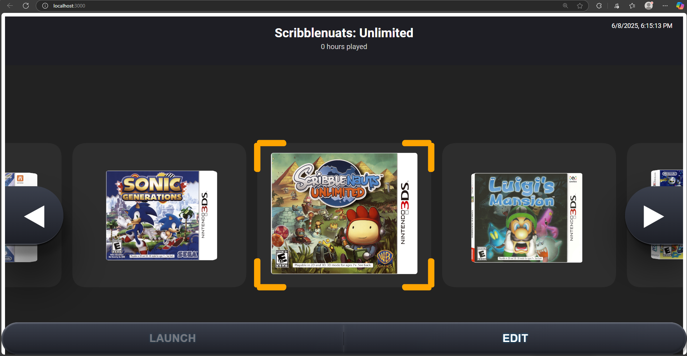 |  |  |
| | |  |

**🎯 Achievement:** Creating Dynamic Layout Systems

I achieved a stable three-layer layout structure that I was really proud of: header component, middle viewport container, and bottom command interface. Building custom SVG components and implementing complex spatial arrangement algorithms for multi-row game display configurations was one of my biggest technical challenges. I eventually realized I was overcomplicating things and reduced scope to focus on stability and performance.

**🔧 Technical Highlights:**
- Three-layer architecture pattern
- Custom SVG component development
- Complex spatial arrangement algorithms
- Performance optimization through scope reduction

---

##  **Phase 8: Feature Completion & Theme System**
*Achieving production-ready state with dual-theme support*

###  **Milestone 17: Comprehensive Theme Architecture**
**Technologies:** CSS-in-JS, Theme Context, Spring Physics  
**Innovation:** Dual-theme system with advanced animations

| Animation Magic | Theme Evolution | Final Polish |
|----------------|-----------------|--------------|
|  |  | 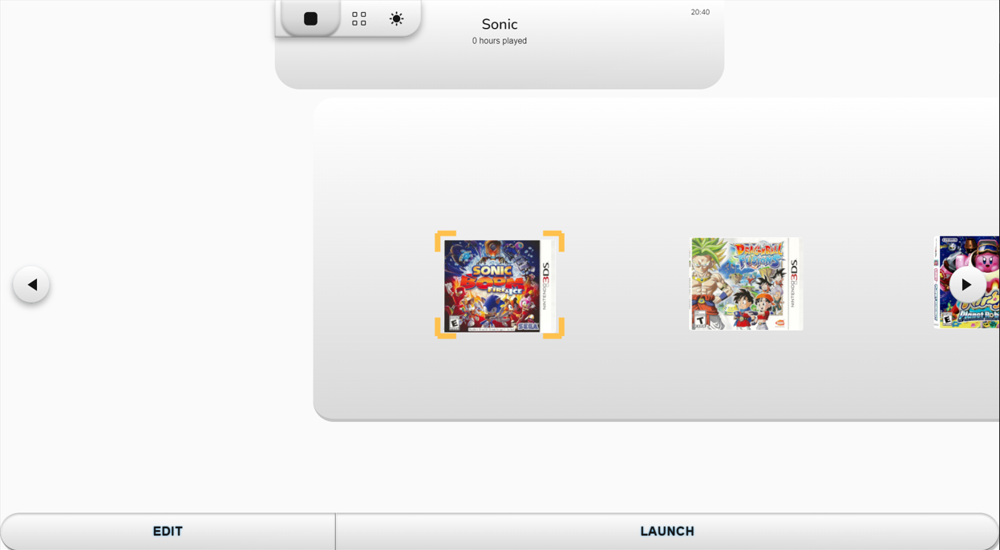 |
|  | |  |

**🎯 Achievement:** Bringing Icons to Life & Theme Mastery

I was so excited to engineer a sophisticated SVG animation system that replicated Nintendo's grid transition patterns! Implementing CSS keyframe animations, transform matrices, and timing functions to achieve bounce and elastic easing effects was incredibly fun. I advanced the animation system with physics-based bounce calculations and jelly-like deformation effects using CSS cubic-bezier curves and spring physics algorithms.

**🔧 Technical Highlights:**
- Nintendo-inspired animation patterns
- Physics-based bounce calculations
- CSS cubic-bezier curves and spring physics
- Centralized theme management system
- Color space transitions

---

##  **Phase 9: Final Production & Architecture Mastery**
*Achieving professional-grade polish and maintainable architecture*

###  **Milestone 18: Component Excellence & Audio Integration**
**Technologies:** Custom SVG Components, Audio State Management, Accessibility  
**Focus:** Professional-grade component development

| Navigation Polish | Audio Controls | System Integration |
|------------------|----------------|-------------------|
| 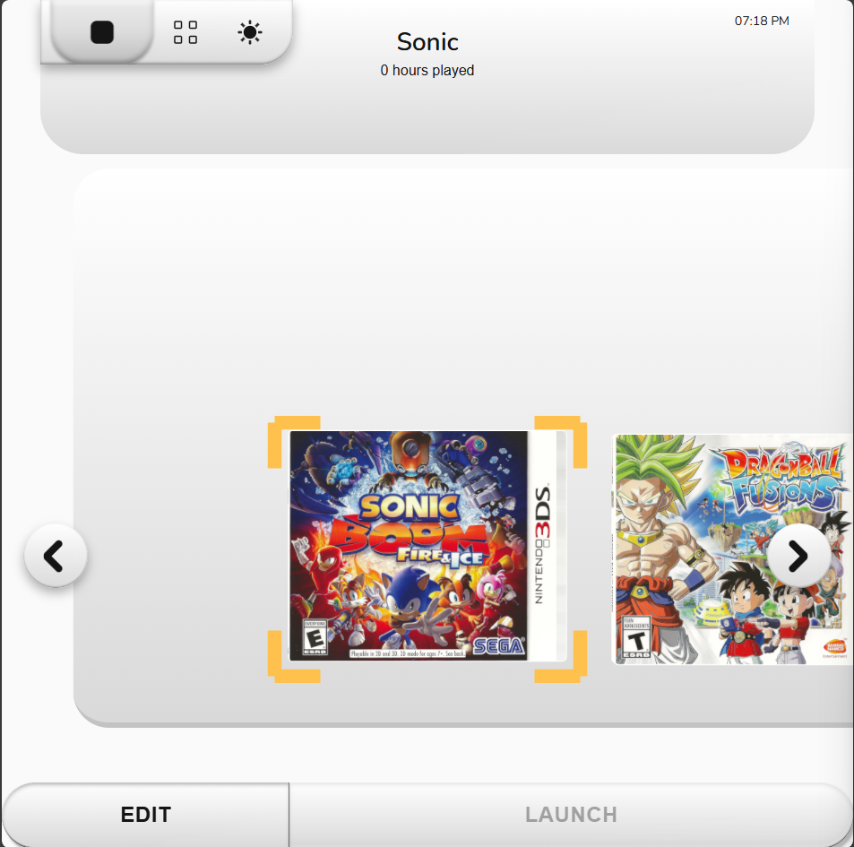 |  |
| |  | |

**🎯 Achievement:** Perfecting Every Detail

I refined the side navigation arrow components with improved visual design, enhanced click target areas, and better integration with my overall design language. I developed sophisticated custom SVG audio control components with theme-aware styling and rounded design language that stayed consistent with my overall application aesthetics. Every detail mattered in achieving that professional polish.

**🔧 Technical Highlights:**
- Custom SVG component optimization
- Theme-aware component styling
- Audio state management with visual feedback
- Accessibility feature implementation

---

###  **Final Achievement: Complete Architecture Mastery**
**Technologies:** Modular Architecture, Design Tokens, Centralized Theme Management  
**Result:** Production-ready application

| **Final Light Theme** | **Final Dark Theme** |
|---------------------|-------------------|
|  | 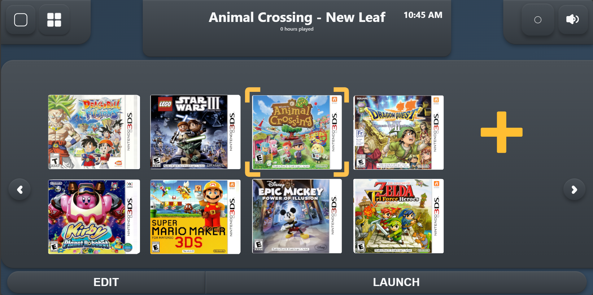 |

**🎯 Achievement:** The Final Achievement - Complete Architecture Refactoring

This was the culmination of my entire journey! I executed comprehensive codebase refactoring with complete modularization of component architecture and implementation of centralized theme management system. I reorganized the entire file structure with clear separation of concerns, implemented unified design tokens across light and dark variants, and achieved consistent visual polish throughout the entire application.

This final iteration demonstrates mature software architecture with maintainable, scalable component systems and professional-grade visual design consistency. Looking back at those early prototypes and seeing where I ended up - it's incredible how much I learned and how far the project has come. This represents not just technical achievement, but months of passion, problem-solving, and creative vision finally coming together into something I'm truly proud to showcase.

## Final Technical Stack:
- **Frontend:** React, TypeScript, Three.js, CSS-in-JS
- **Backend:** Express.js, SQLite, RESTful APIs
- **Desktop:** Electron with IPC communication
- **Graphics:** WebGL, Custom shaders, Advanced lighting
- **Architecture:** Modular components, Centralized theming, Clean separation of concerns

---

##  **Development Metrics**

| **Category** | **Achievement** |
|-------------|----------------|
| **Total Milestones** | 18 Major Phases |
| **Technologies Mastered** | 15+ Technologies |
| **Architecture Patterns** | 5 Major Refactors |
| **UI Themes** | 2 Complete Themes |
| **3D Rendering Features** | Advanced Lighting, Texturing, Animation |
| **Backend Integration** | Full CRUD, Real-time Updates |

---

##  **Key Learning Outcomes**

###  **Technical Mastery**
- **3D Graphics Programming:** Three.js, WebGL, advanced rendering techniques
- **Full-Stack Development:** React, Express.js, SQLite, real-time data synchronization
- **Performance Optimization:** GPU memory management, object pooling, batch rendering
- **UI/UX Design:** Component architecture, theme systems, accessibility

###  **Problem-Solving Evolution**
- **Architectural Thinking:** Progressed from monolithic to modular design patterns
- **Performance Consciousness:** Learned to balance feature complexity with system performance
- **User Experience Focus:** Evolved from functionality-first to user-centered design approach
- **Code Quality Standards:** Implemented maintainable, scalable architectural patterns

###  **Creative Vision Development**
- **Design Consistency:** Achieved professional-grade visual polish across all components
- **Brand Identity:** Developed Nintendo-inspired aesthetic with personal creative touches
- **Animation Expertise:** Mastered physics-based animations and smooth user interactions
- **Attention to Detail:** Learned the importance of micro-interactions and visual feedback

---

*More than anything, this journey represents the power of disciplined perseverance. It was a daily lesson in showing up, making small iterative improvements, and having the tenacity to perfect every detail until the final product matched the initial vision. It proved that consistent effort is the foundation of every significant achievement.* 
